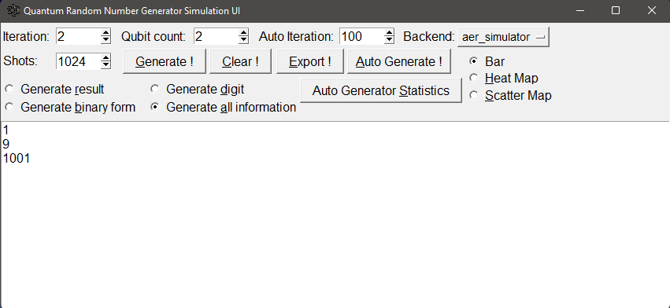

This a GUI application build using Tkinter and Qiskit, which it will generate a random number from (n) H-gate,
it will created a random number using combination of (n) measured qubit with highest frequency.
All number bit string are stored into a list, after that converted into binary and finally converted into integer.
We can choose what chart what we want, little advice if you want visualize small set of data you can use Bar Map and for big set of data you can use Scatter Map.

Sample:

This project inspired by [this post](https://blog.red-badger.com/2018/9/24/generate-true-random-numbers-with-a-quantum-computer).

further reading :
https://www.nature.com/articles/s41598-019-56706-2