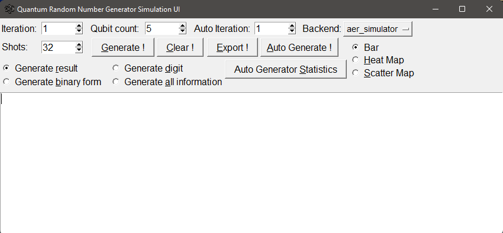
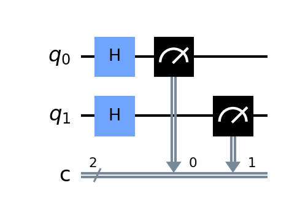
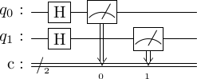

This a GUI application build using Tkinter and Qiskit, which it will generate a random number from (n) `H-gate`,
it will created a random number using combination of (n) measured qubit with highest frequency.
All number bit string are stored into a list, after that converted into binary and finally converted into integer.
We can choose what chart what we want, little advice if you want visualize small set of data you can use Bar Map and for big set of data you can use Scatter Map. After generate a number you can factorize that number using Shor's algorithm.

Sample:

***The number generated by Qiskit are little endian format***

This project inspired by [this post](https://blog.red-badger.com/2018/9/24/generate-true-random-numbers-with-a-quantum-computer).

further reading :
https://www.nature.com/articles/s41598-019-56706-2

For web version you can get from here :
* [Github](https://github.com/AFOEK/Quantum_Random_Number_Generator_Flask)
* [Heroku](qrng-flask.herokuapp.com)

Future feature:
- [x] Make a clone for web app and deploy
- [x] Add documentation and sample
- [x] Add Shor's algorithm for factorization
- [x] Add GPU option to run quantum circuit(Nvidia GPU)
- [ ] Adding Option for factorization using _General Number Field Sieve_ (GNFS)
- [ ] Able to run on real quantum device
- [ ] Able to convert little endian ↔ big endian
